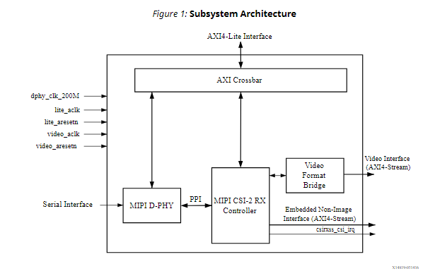
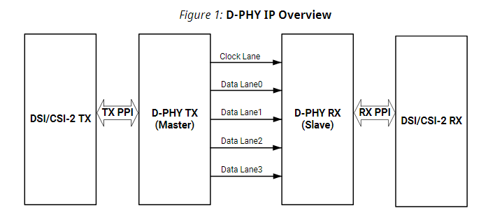

FPGA摄像头MIPI协议学习历程
===================
***
关于摄像头mipi的结构
---------------------
目前已知的,mipi从输入到最终取到视频流需要经过几个层次。
分别是：
* 应用层
  * 主要是PS端对于协议那一部分的控制
* 协议层
  * 代指很多,主要就是CSI协议相关
* 物理层
  * 物理层面上各个芯片之间的连接

比较经典的摄像头mipi输入,到跨时钟域处理，以及后续的数据处理的<u>拓扑结构</u>从左到右分别是*Sensor*，*D-PHY IP*，*CSI RX IP*，*Video pipe*和*Video buffer*。

其中D-PHY ip处理的是物理传输级的mipi信号,这里暂时不展开,已知的是该信号包含多个差分信号和多条lane，以及一组i2c信号(i2c会被单独处理，并不是交给dphy处理)。该ip将mipi信号转换为我之后要重点讨论的CSI信号。

一般的FPGA厂商会直接提供该IP,在这里我先会直接使用它,至于手撕MIPI协议的任务我将放到之后。

***
关于MIPI CSI-2 Receiver Subsystem的接口学习
---
Xilinx提供了一个可以直接连接图像源的子系统,称作`MIPI CSI-2 Receiver Subsystem`。
 `MIPI CSI-2 Receiver Subsystem:MIPI CSI-2接收子系统
 允许您基于MIPI协议快速创建系统。
 它在基于MIPI的图像传感器和图像传感器管道之间进行接口连接。
 内部提供了一个高速物理层设计——D-PHY,允许直接连接到图像源。
 顶层定制参数可以选择构建子系统所需的硬件模块。`

#### 以下是该子系统的框架示意图

---

事实上,给到该子系统的一般信号,即左上角的一众时钟以及rst信号,再就是AXI4-Lite的接口信号，应该是负责对该子系统的参数做一些调整或是控制，可以暂时先放下不管。

重点关注的是左下角与右下角的信号。
可见该子系统将mipi的物理信号最终转化为axi stream信号,这里也是将重点讨论的部分。

***
MIPI D-PHY的理解
---
关于D-PHY Xilinx给出了单独的数据手册,接下来重点学习该IP。简单来说,该ip即将物理层
信号转化为高级协议CSI-2(also can be DSI,which for displaying),方便后续的信号处理。
#### 以下是该IP的框架示意图


MIPI D-PHY控制器提供了主设备和从设备之间的点对点连接,或者主机和设备符合相关的MIPI标准。
典型的TX配置包括1个时钟通道和1 ~ 4个数据通道,典型的RX配置包括1个时钟通道和1 ~ 8个数据通道。
主机主要是数据的来源,从设备通常是数据的接收端。
D-PHY通道可以配置为单向通道操作,起源于主设备,终止于从设备。

D-PHY可能包含
  * 低功耗发送器—Low-Power Transmitter(LP-TX)
  * 低功耗接收器—Low-Power Receiver(LP-RX)
  * 高速发送器—High-Speed Transmitter(HS-TX)
  * 高速接收器—High-Speed Receiver(HS-RX)
  * 低功耗竞争检测器—Low-Power Contention Detector(LP-CD)

和三个主要的lane种类
  * 单向时钟Lane
    * Master:HS-TX, LP-TX
    * Slave:HS-RX, LP-RX
  * 单向数据Lane
    * Master:HS-TX, LP-TX
    * Slave:HS-RX, LP-RX
  * 双向数据Lane
    * Master, Slave:HS-TX, LP-TX, HS-RX, LP-RX, LP-CD

简单来说,DPHY的数据接收端是来自摄像头的时间差分与数据差分信号,输出则是hs、lp的信号。
该模块目前所有例程都是通过调用平台ip,所以暂时就了解到这。

仅通过以上的认识并不足以理解mipi的信号,接下来通过纯v代码来继续学习。

***
mipi_csi_16_nx的学习历程
---
```verilog
module mipi_csi_16_nx(	//reset_in,
	mipi_clk_p_in,
	mipi_clk_n_in,
	mipi_data_p_in,
	mipi_data_n_in,

        pclk_o,  //data output on pos edge , should be latching into receiver on negedge
	data_o,
	fsync_o, //active high 
	lsync_o, //active high
						
	//these pins may or many not be needed depeding on hardware config
	//cam_ctrl_in, //control camera control input from host
	cam_xce_o, //camera interface selection 
	cam_pwr_en_o, //enable camera power 
	cam_reset_o,  //camera reset to camera
	cam_xmaster_o //camera master or slave 
);

parameter MIPI_LANES = 2;			//number of mipi lanes with camera. Only 2 or 4

input mipi_clk_p_in;
input mipi_clk_n_in;
input [MIPI_LANES-1:0]mipi_data_p_in;
input [MIPI_LANES-1:0]mipi_data_n_in;
```
显然相机能提供的信号主要就是差分时钟和差分数据信号,摄像头一般能给到的raw数据有多种,
不同的格式的处理方式也各不一致。


